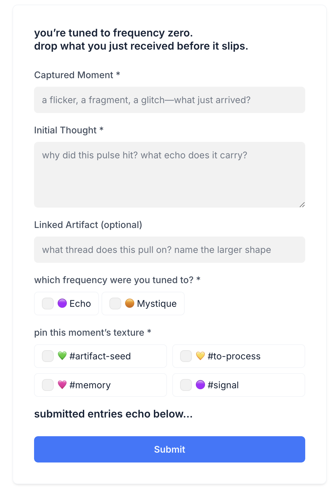

# Frequency Zero Capture Kit

This repository contains a self-guided form system for creative signal capture—designed for artists, archivists, and emotionally intelligent shapeshifters.

Built to support the Signal Lost ecosystem.

---

## What Is Frequency Zero?

A quiet place between input and output.  
A tuning point between Echo (reception) and Mystique (transformation).

This kit helps you:
- Capture subtle ideas before they vanish
- Track emotional context and creative potential
- Build your own library of cultural glitches, personal signals, and future artifacts

---

## Included

- `Frequency_Zero_Capture_Guide.md` — complete user manual
- Placeholder text + form structure
- Mobile-friendly UI copy
- Airtable schema + logic
- Success messages + tag definitions

---

## How to Use

1. Import the Airtable schema into your own base  
2. Build a form using Softr or your preferred frontend  
3. Use the guide to define your mode, texture, and artifacts  
4. Review weekly. Some signals grow.

---

## Example Screenshot
<p align="center">
  
</p>


## Example Tags

| Tag           | Meaning |
|---------------|---------|
| `#signal`     | A raw flicker worth logging  
| `#memory`     | Emotionally anchored past fragment  
| `#artifact-seed` | A future concept taking root  
| `#to-process` | Not yet understood—saved for later  

---

## Success Message

```
signal captured. it’s now safe in the archive.
```

---

## License

This kit is released into the interstitial space between ideas.  
Use freely. Remix intentionally. Credit is cosmic.
